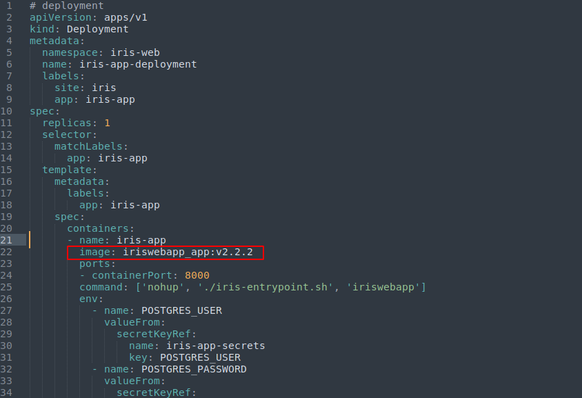
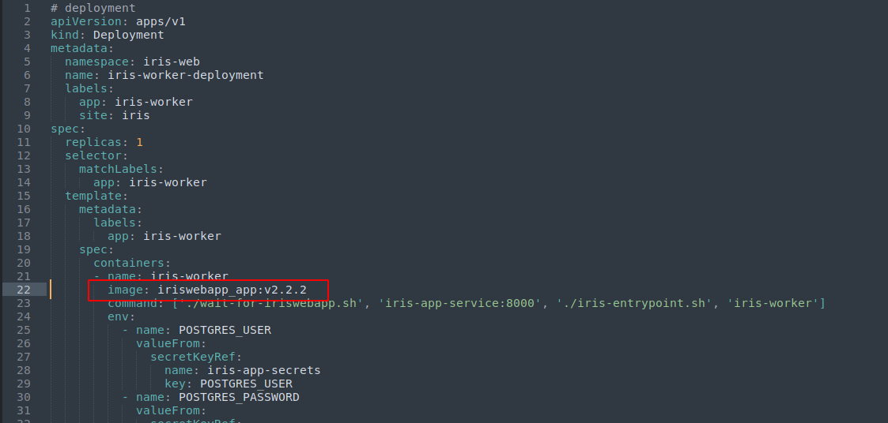
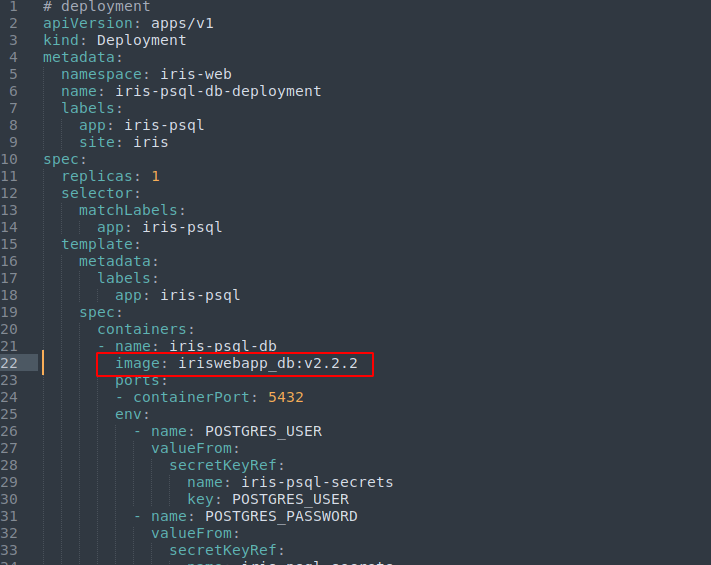
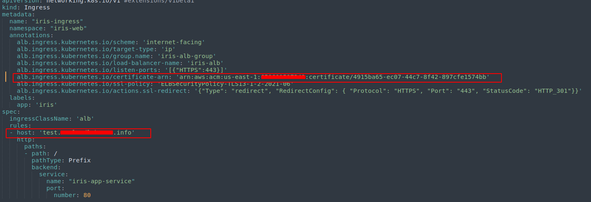

# The Iris EKS manifest to deploy Iris-web on AWS EKS.

Description:
  - This manifest file will help to deploy the application on the AWS EKS.

## Prerequisites;
 - Install AWS [CLI](https://docs.aws.amazon.com/cli/latest/userguide/getting-started-install.html#getting-started-install-instructions) 
 - Setup AWS EKS cluster. (terraform example [here](https://github.com/s3lva-kumar/terraform-aws-eks))
 - Install AWS ebs CSI driver add-on on EKS cluster. (terraform example [here](https://github.com/s3lva-kumar/terraform-eks-plugin/tree/master/terraform-amazon-ebs-csi-driver))
 - Install AWS alb ingress controler add-on on EKS cluster. (terraform example [here](https://github.com/s3lva-kumar/terraform-eks-plugin/tree/master/terraform-amazon-alb-ingress))

## Build & push Docker Images
  - To build the docker images follow the commands 👇
   ``` bash
   #  Clone the iris-web repository
   $ git clone https://github.com/dfir-iris/iris-web.git
   $ cd iris-web

   # Build the dockers (Build webApp and db docker images, skip the nginx because we using AWS ALB instead of nginx)
   # app & woker:
   $ docker build -t webapp:latest -f docker/webApp/Dockerfile .
   # DB:
   $ docker build -t db:latest -f docker/db/Dockerfile .
   ```
- Once the docker images built, push those images into AWS ECR

## Deploy:
 - Before we deploy the manifeat, we need to update the Docker image on our manifest.

   *Note: Same docker image to the app and worker*
 - ### update app image:
    - Naviaget to the deploy/eks_manifest/app directory.
    - open the *deployment.yml* file and update the image here, which we pushed on the ECR.
    
- ### update worker image:
    - Naviaget to the deploy/eks_manifest/worker directory.
    - open the *deployment.yml* file and update the image here, which we pushed on the ECR.
    

- ### update db image:
    - Naviaget to the deploy/eks_manifest/psql directory.
    - open the *deployment.yml* file and update the image here, which we pushed on the ECR.
    

- ### update the SSL and domain name on app ingress YAML file
    - Naviaget to the deploy/eks_manifest/app directory.
    - open the *ingress.yml* file and update the SSL and host
    
    - *Note:*
      - SSL : 
        Give a ACM certificate ARN.
      - HOST : 
         Give the host name whatever you want. In additionally, once the ingress created it will be provisioned the ALB on AWS with this name "iris-alb". Then, configure the DNS 'CNAME' record with hostname *(which you given on ingress file)* point to the AWS alb 'DNS'
         

- ### once updated the all the things which is mentioned above, then run the **Makefile**
    - Navigate to the *deploy/eks_manifest*, here you can see the 'Makefile'
    - To deploy app, run 
      ``` bash 
        $ make
        $ make create
         ```
    - To delete app, run
      
      *caution: it will be delete all things exclude DB*
      ``` bash
        $ make
        $ make delete
      ```


- ### Get Admin username and password
    - Once everything created we can get administrator username and password from the app _pod_

      ``` bash
       $ kubectl get pod -n iris-web
       # Copy the pod name and give it on the below command (pod name looks like "pod/iris-app-deployment-🎲")
       $ kubectl logs <pod_name> -n iris-web
       # You can see the credential at the end of the logs
      ```