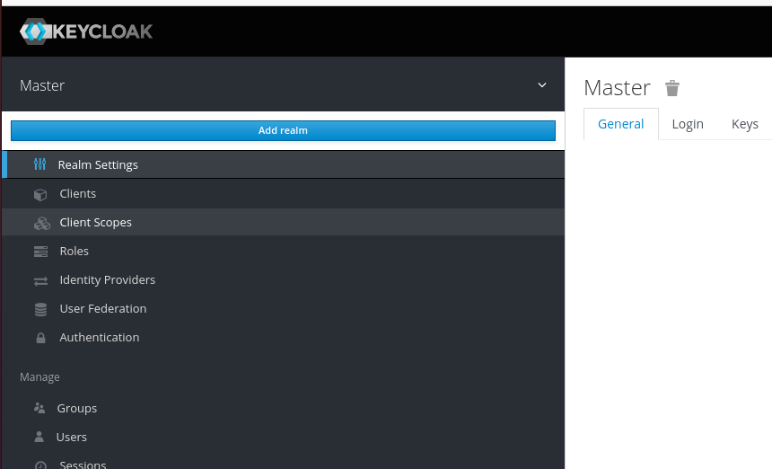
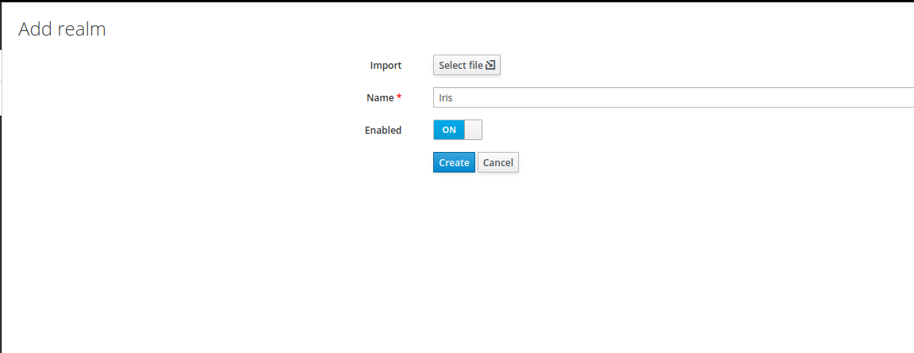
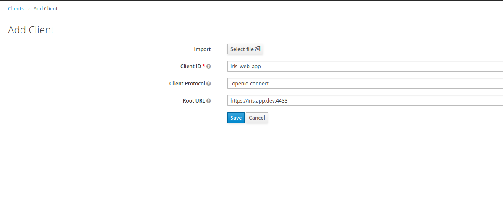
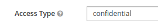
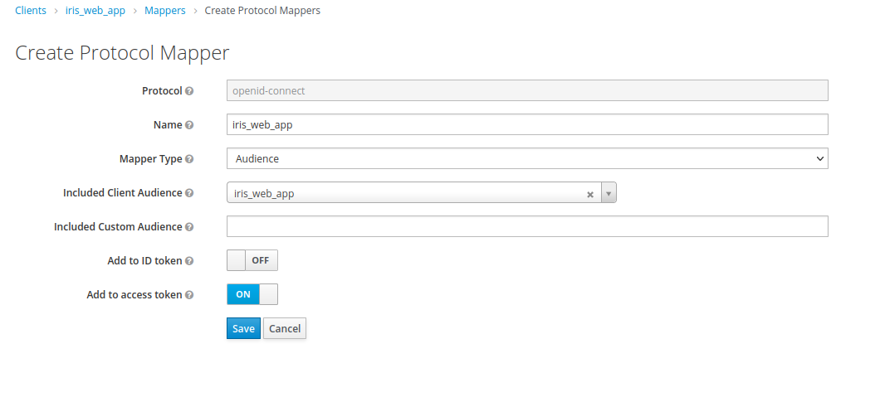
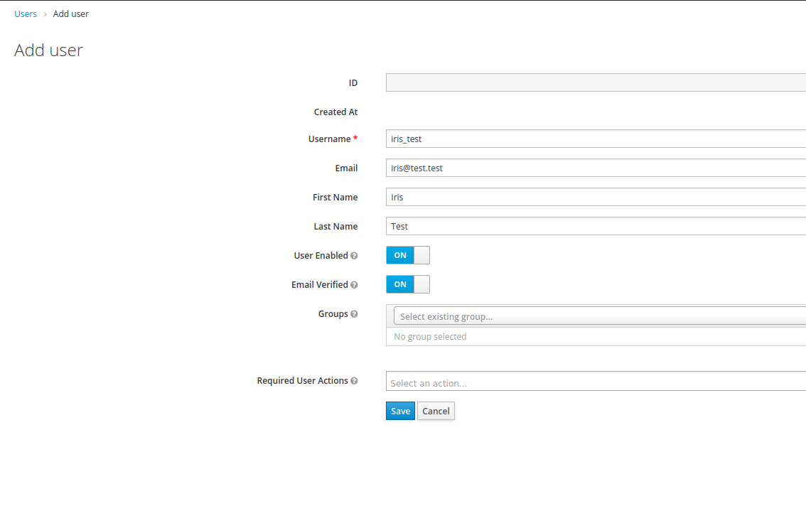

# OIDC Authentication

This method of authentication is based on 2 elements:

* An authentication proxy: OAUTH2_PROXY
* An authentication server: KEYCLOAK

# Prerequisites

The management of self-signed certificates by the different components is ... interesting.  
In order to simplify the development/integration, a self-signed root CA has been created. It needs to be imported in the web browser certificate store.  
This rootCA certificate can be found under the eponymous folder.

Moreover, oauth2proxy except that the authentication server provides a SAN certificate ([https://en.wikipedia.org/wiki/Subject_Alternative_Name](https://en.wikipedia.org/wiki/Subject_Alternative_Name))
Such certificate can be found in the `docker_authentication/certificates/` folder.

2 entries need to be added to the */etc/hosts* file:

* `127.0.0.1 auth_iris.app.dev`
* `127.0.0.1 iris.app.dev`

# Keycloak configuration

Launch the 3 containers dedicated to the authentication server in the following order, waiting a couple of seconds between each:

* keycloak_db
* keycloak
* keycloak_proxy

Once everything is up and running, connect to the administration console at [https://auth_iris.app.dev:9443](https://auth_iris.app.dev:9443).
The credentials for the admin account are set in environment variables file `.env` located in the `docker_authentication/` folder.
At the moment, you can log in using the following credentials: `kc_admin/AZert12@`

## Realm creation

Now that you are connected to the master realm, create a new realm (let's call it Iris) by clicking on the arrow next to "Master"





Once this new realm is created, you are directly placed into it. It is now time to create a Client and a User

## Client creation

Create a new client in the Client section.  
Add and id, in our case *iris_web_app*.  
Add the root URL, in our case *https://iris.app.dev:4433*



## Client configuration

Once created, activate *Always Display in Console* and set the *Access Type* to *confidential*



After doing this, a new tab called *Credentials* should appear.  
It contains a very important information: the **client secret**  

Add a new audience mapper in the *Mappers* tab as follows:



Create a role for the administrators in the Role tab.

The configuration of the client is now finished.

## User creation

To create a new user, go to the *Users* section and click on *Add user*   
Fill in the information. the *Email* field is mandatory and the *Email Verified* field must be set to true (this can be changed ... needs to be discussed) 



Once created, set a password in the *Credentials* tab

# Authentication Proxy Configuration (OAUTH2_PROXY)

## Configuration file

The configuration file of the authentication proxy is located in *irisweb/docker_authentication/proxy/oauth2-proxy\_###\_.cfg*

Several parameters inside this file must be configured:

* `tls_cert_file` & `tls_key_file` : must reference the certificate that is to be used for https.
* `upstreams` : address of the internal service to forward the incoming requests to. Ex value: `upstreams=["https://nginx:8443"]`
* `whitelist_domains` : used to whitelist redirection domains. For example, it is possible to add redirection after a logout on the proxy. Usually this redirect url is set to the logout url of the authentication server. If the authentication server is on another domain, it must be added to this parameter. Ex value: `whitelist_domains=["auth_iris.app.dev:9443"]`
* `insecure_oidc_allow_unverified_email` : must be set to true, otherwise the emails of the users must be set to *verified* on the authentication server
* `email_domains` : must be set to `'*'` to allow all email domains to be able to connect
* `provider_ca_files` : this should be set if the authentication server does not have a certificate signed by a trusted CA. Ex value: `provider_ca_files=["/etc/rootCA.pem"]`
* `client_id` :  id of the considered client in the AuthN server. Ex value: `client_id="iris_web_app"`
* `client_secret` : secret of the considered client in the AuthN server. Ex value: `client_secret="2QvSmbHY8csi9VAJbCATzQCcsoJKY2Gs"`
* `redirect_url` : the OAuth redirect URL. Ex value: `redirect_url="https://iris.app.dev:4443/oauth2/callback"`
* `oidc_issuer_url` : the OpenID Connect issuer URL. Ex value: `oidc_issuer_url="https://auth_iris.app.dev:9443/auth/realms/Iris"`
* `cookie_secret` : the seed string for secure cookies (optionally base64 encoded)

## Docker compose file

For testing purposes, a Nginx container called test_web_application can be run. It serves a single web page, *test_web_page.html*  
To forward request to this container, add *http://test_web_application* in the *upstreams* list and set the oauth2proxy configuration file to `oauth2-proxy_test-web-app.cfg` in the authentication docker-compose file

The oauth2proxy also needs to be placed inside the protected app's docker network.
As it is currently structured, if trying to add authentication to iris web app, the oauth2proxy needs to use a network declared externally (i.e. inside the app docker compose file). Example of configuration: 
```
# AUTHENTICATION PROXY
  proxy:
    ...
    networks:
      - app_network
    
    ...
      
    app_network:
        external: true
        name: iris_frontend
```

# Keycloak role based client log-in access restriction for users

(https://stackoverflow.com/questions/57287497/keycloak-role-based-client-log-in-access-restriction-for-users)

# Notes

## Addresses

### Authentication proxy:

**https://iris.app.dev:4443**

### Authentication server:

**https://auth_iris.app.dev:9443**

## Log Out

To log out, use the following url:

`https://iris.app.dev/oauth2/sign_out?rd=__KEYCLOAK_LOGOUT_ENDPOINT__?redirect_uri=__APP_URI__`

`__KEYCLOAK_LOGOUT_ENDPOINT__` can be found in the .well_known page of the Keycloak realm -> Realm Page / Real settings section / General / Endpoints / OpenId Endpoint Configuration link  
`__APP_URI` is the uri set in the realm client's *Valid Redirect URIs*
